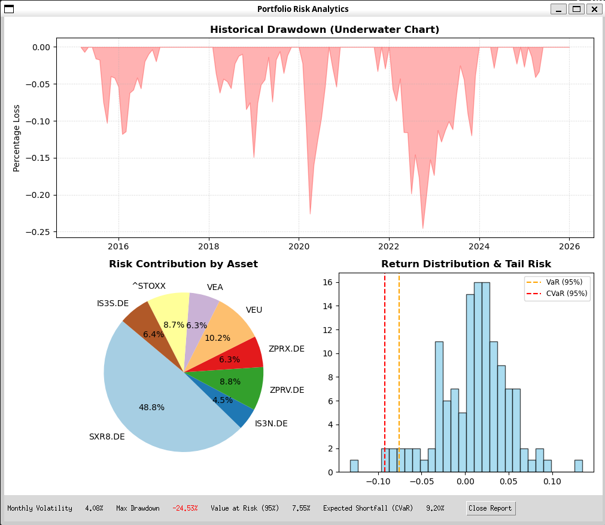

# quant-lab-alpha — Portfolio Factor Regression & Analysis Toolkit

**Quant Lab Alpha** is a Python toolkit for systematic portfolio analysis and factor-based investing.  
It is built around the **Fama–French Five-Factor (FF5) Model**, with extensions into Monte Carlo simulation and classical portfolio optimization.

The framework provides a clean, reproducible workflow for **academic replication**, **portfolio construction**, and **long-horizon outcome analysis**.

---

## Disclaimer

**This repository is strictly for educational and research purposes.**  
All calculations, regressions, and results are **not financial advice**.  
Past performance does **not guarantee future results**.  

Any example portfolios included in this project are **approximations of conceived factor exposure strategies**, not investment recommendations.  
Users are solely responsible for any decisions or applications derived from this toolkit.

---

## Acknowledgements

The developer thanks **Curvo.eu** and **Benjamin Felix (PWL Capital, Canada)** for permission to use selected datasets and published results.  
These have been used solely to benchmark and validate analysis code within the Jupyter notebooks.

---

## 1. Fama–French Five-Factor (FF5) Regressions  
**Implemented**


- Factor data ingestion from the Ken French Data Library  
- Portfolio- and asset-level FF5 regressions  
- **Rolling regressions** over configurable windows (e.g. 3y / 5y / 10y)  
- Factor exposure, alpha, and contribution analysis  

---

## 2. Markowitz Portfolio Optimizer  
**Implemented**


- Mean–variance optimization  
- Covariance estimation from historical or factor-implied returns  
- Efficient frontier construction  
- Optimal portfolios under classical Markowitz assumptions  

---

## 3. Risk Report  
**Implemented**




- Historical drawdown chart  
- Asset and Factor level risk contribution assessment  
- Monthly CVaR/VaR at 95% confidence  

---

## 4. Correlation Matrix  
**Implemented**


- Check inter-asset correlations (-1, 1)  
- Heatmap view  

---

## 5. Monte Carlo Retirement Simulation  
**Implemented**


- Synthetic return histories generated via FF5-fitted models  
- Block / bootstrap-style simulations  
- Static-weight portfolios  
- Multiple withdrawal strategies:
  - Fixed 4% (initial capital)
  - Variable 4% of current capital
  - Guardrails (2.5–5%)
  - Bucket strategy
- Failure probability and terminal wealth analysis  

**In Development**
- Improved stress testing and scenario labeling
- Plug and play strategy implementation

---

## Currency Support

**Implemented**

- Automatic currency detection via Yahoo Finance metadata  
- FX normalization to USD for cross-currency portfolios  
- Seamless integration into FF5 analysis and Monte Carlo simulations  

---

## Assumptions and Limitations

As a toolkit built to study financial theory, a number of regional and broker-dependent real world effects are excluded for simplicity. This alters the outcome from what may be realistically achievable. Differences may be accounted for externally when choosing inputs. The following limitations must be kept in mind:  

- Currently all assets are converted to USD to allow for cross currency portfolios and regressions to academic factors
- Portfolio weights are currently assumed to remain constant; drift and rebalancing are planned in a future update
- Leverage multipliers assumed to be constant; realistically hard borrowing limits, maximum permitted loan-to-value ratios and margin calls significantly limit this strategy
- Assets with short histories are extended using synthetic returns generated from FF5 regressions  
- Taxes are **not** modeled; withdrawals currently represent spending *plus* taxes  
- The Markowitz optimizer runs on a limited random sample; direct solvers (e.g. `pypfopt`) would yield more robust solutions  
- Primary market data is sourced from Yahoo Finance; additional data providers are planned  

---

## Realism Update™ (In Development)

Features that materially increase realism but are currently separated to keep the core engine clean and interpretable:

- **Portfolio rebalancing**
- **Inflation-adjusted withdrawals**
- Limited leverage model imposing hard loan amount cap, loan-to-value ratio and margin calls
- Real (not just nominal) return tracking  
- Stress testing with ±1% return and +20% volatility shocks  

These features are planned as **opt-in layers**, not hardwired assumptions.

---

## Known Issues
- Currently empty, please report any bugs to me directly at **husainm97@gmail.com**
- Recent fixes: Markowitz optimiser weights now apply in Treeview, negative wealth paths are terminated in simulations

---
## Getting Started

### 1. Clone the repository
```
bash
git clone https://github.com/husainm97/quant-lab-alpha.git
cd quant-lab-alpha
```

### 1. **Launch the interface**
```
python main.py
```
