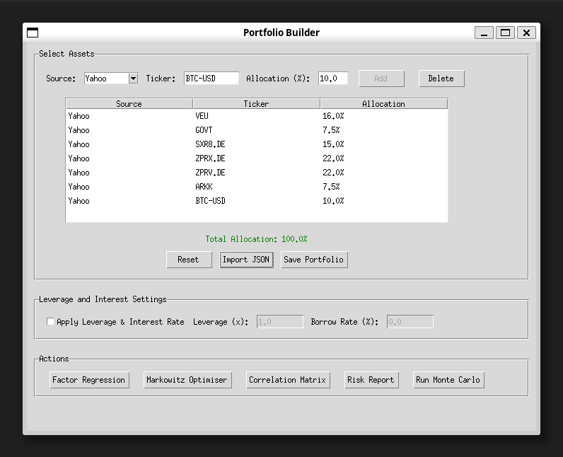
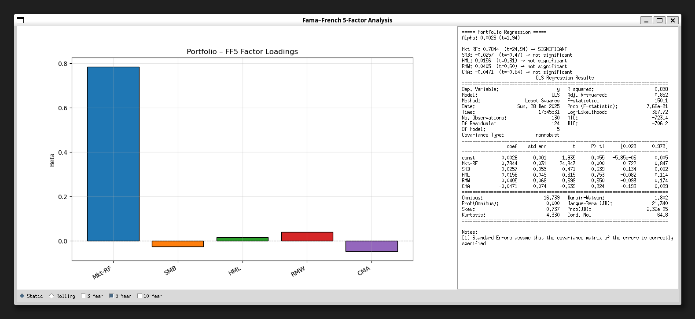
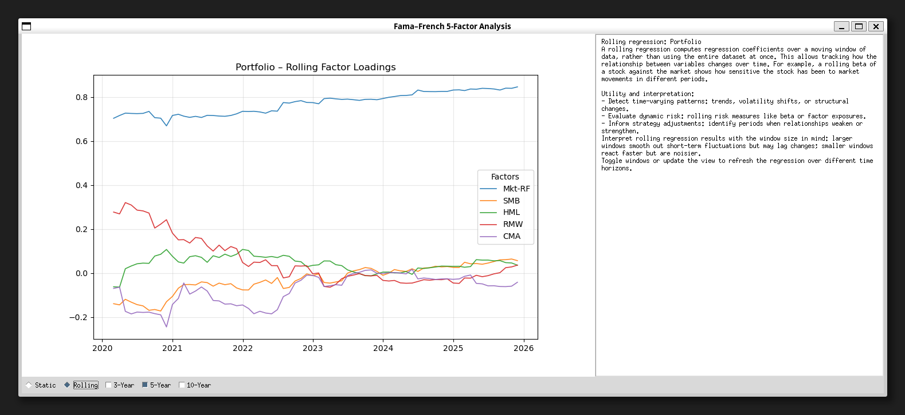
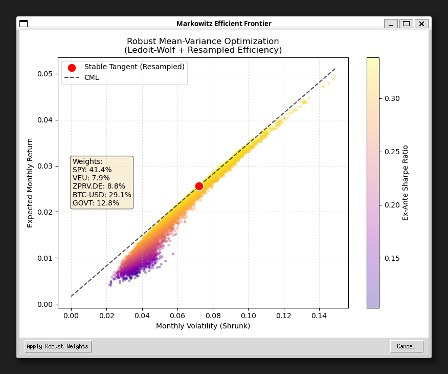
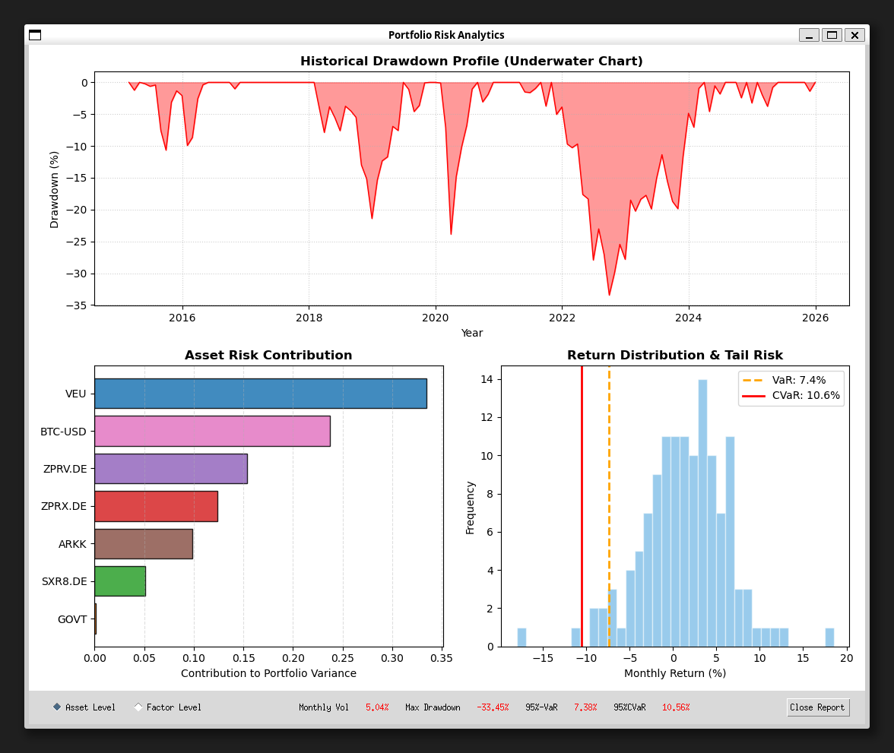
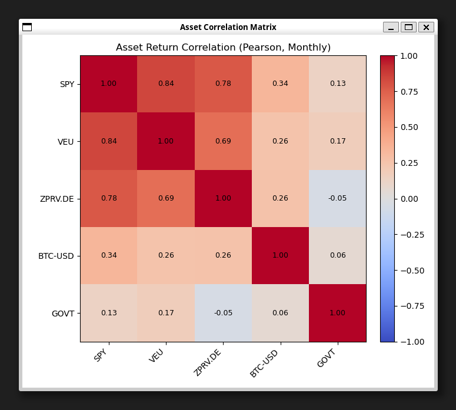
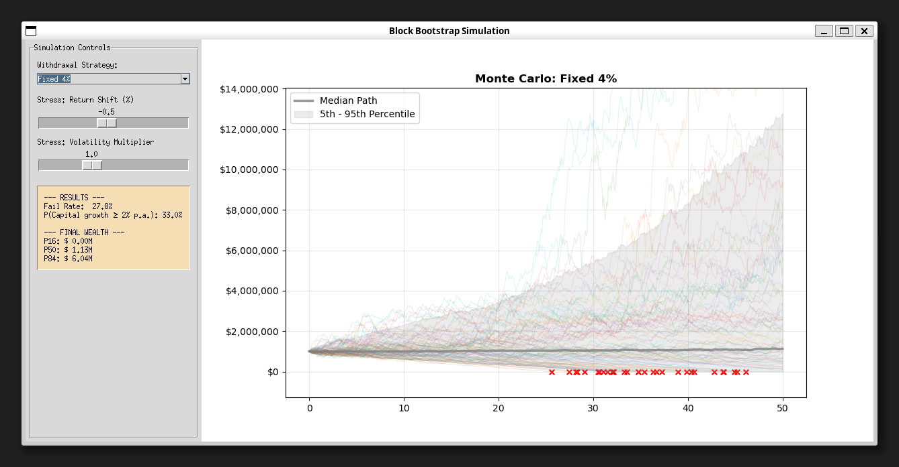

# quant-lab-alpha — Portfolio Factor Regression & Analysis Toolkit

**Quant Lab Alpha** is a Python toolkit for systematic portfolio analysis and factor-based investing.  
It is built around the **Fama–French Five-Factor (FF5) Model**, with extensions into Monte Carlo simulation and classical portfolio optimization.

The framework provides a clean, reproducible workflow for **academic replication**, **portfolio construction**, and **long-horizon outcome analysis**.

This project is intended for **students, researchers, and practitioners** interested in factor-based portfolio analysis and quantitative risk modeling.

---

## Disclaimer

**This repository is strictly for educational and research purposes.**  
All calculations, regressions, and results are **not financial advice**.  
Past performance does **not guarantee future results**.

Any example portfolios included in this project are **approximations of conceived factor exposure strategies**, not investment recommendations.  
Users are solely responsible for any decisions or applications derived from this toolkit.

---

## Acknowledgements

The developer thanks **Curvo.eu** and **Benjamin Felix (PWL Capital, Canada)** for permission to use selected datasets and published results.  
These have been used solely to benchmark and validate analysis code within the Jupyter notebooks.

---

## Interactive GUI (Tkinter)  
**Implemented**



- Simplified GUI-based portfolio builder  
- Save and import portfolios and settings  
- Toggle leveraged strategies  
- One-click access to the full analysis suite  

---

## 1. Fama–French Five-Factor (FF5) Regressions  
**Implemented**

  


- Factor data ingestion from the Ken French Data Library  
- Portfolio- and asset-level FF5 regressions  
- **Rolling regressions** over configurable windows (e.g. 3y / 5y / 10y)  
- Factor exposure, alpha, and contribution analysis  

---

## 2. Markowitz Portfolio Optimizer  
**Implemented**



- Mean–variance optimization  
- Covariance estimation from historical or factor-implied returns  
- Efficient frontier construction  
- **Ledoit–Wolf covariance matrix shrinkage**  
- Direct application of optimal weights to the active portfolio  

---

## 3. Risk Report  
**Implemented**



- Historical drawdown analysis  
- Asset- and factor-level risk contribution assessment  
- Monthly CVaR and VaR at 95% confidence  

---

## 4. Correlation Matrix  
**Implemented**



- Inter-asset correlation inspection (−1 to 1)  
- Heatmap visualization for rapid structure assessment  

---

## 5. Monte Carlo Retirement Simulation  
**Implemented**



- Synthetic return histories generated via FF5-fitted models  
- Block / bootstrap-style simulations  
- Static-weight portfolios  
- Multiple withdrawal strategies:
  - Fixed 4% (initial capital)
  - Variable 4% of current capital
  - Guardrails (2.5–5%)
  - Bucket strategy  
- Failure probability and terminal wealth analysis  

**In Development**
- Improved stress testing and scenario labeling  
- Plug-and-play withdrawal strategy implementation  

---

## Currency Support  
**Implemented**

- Automatic currency detection via Yahoo Finance metadata  
- FX normalization to USD for cross-currency portfolios  
- Seamless integration into FF5 analysis and Monte Carlo simulations  

---

## Assumptions and Limitations

As a toolkit designed to study financial theory, several regional, institutional, and broker-dependent real-world effects are intentionally excluded. This simplifies interpretation but may deviate from realizable outcomes.

Key limitations include:

- All assets are converted to USD to enable cross-currency factor regressions  
- Portfolio weights are assumed to remain constant (rebalancing planned)  
- Leverage multipliers are static; real-world borrowing constraints are not modeled  
- Assets with short histories may be extended using FF5-based synthetic returns  
- Taxes are **not** modeled; withdrawals represent spending *plus* taxes  
- The Markowitz optimizer uses randomized sampling; direct solvers (e.g. `pypfopt`) would be more robust  
- Market data is sourced from Yahoo Finance; additional providers are planned  

---

## Realism Update™ (In Development)

Features that materially increase realism but are intentionally separated to keep the core engine clean and interpretable:

- **Portfolio rebalancing**
- **Inflation-adjusted withdrawals**
- Limited leverage model with loan-to-value caps and margin calls  
- Real (not just nominal) return tracking  
- Stress testing with ±1% return and +20% volatility shocks  

These will be introduced as **opt-in layers**, not hardwired assumptions.

---

## Known Issues
- Currently none. Please report bugs directly to **husainm97@gmail.com**  
- Recent fixes:
  - Markowitz optimizer weights now correctly apply in the Treeview  
  - Negative wealth paths are terminated in Monte Carlo simulations  

---
Pull requests, suggestions and bug reports are welcome.

---
## Getting Started

### 1. Clone the repository
```
bash
git clone https://github.com/husainm97/quant-lab-alpha.git
cd quant-lab-alpha
```

### 2. **Install dependencies**
```
python main.py
```

### 3. **Launch the interface**
```
python main.py
```
