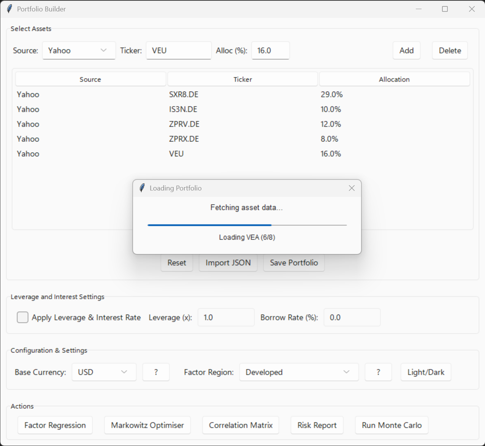
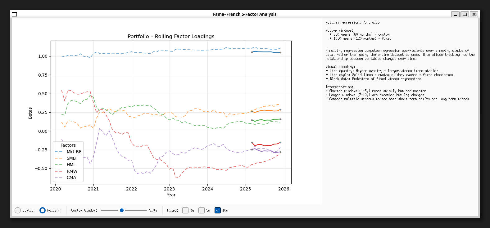
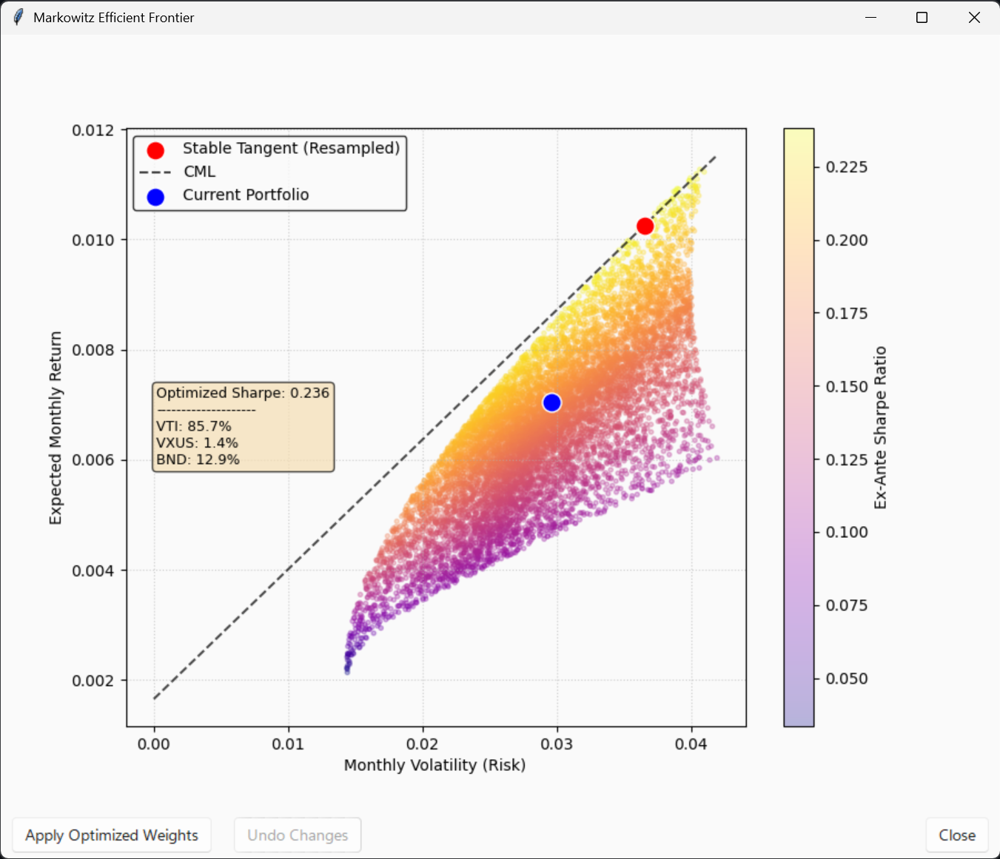
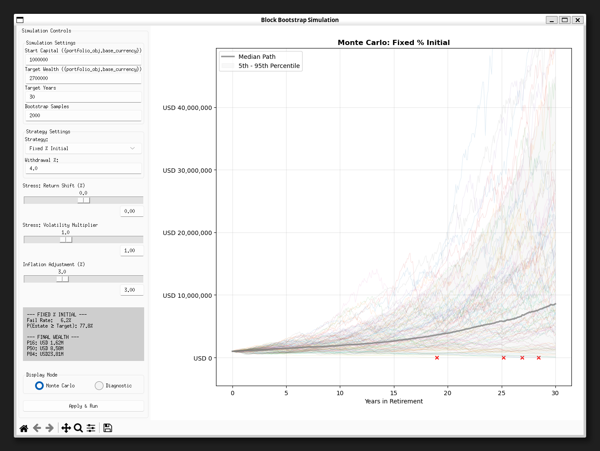
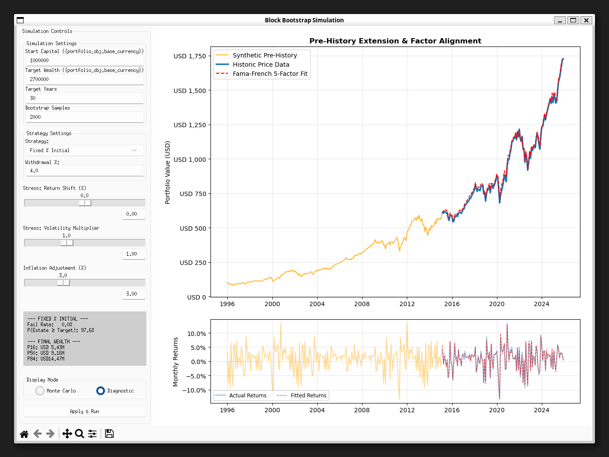

# 📊 quant-lab-alpha — Portfolio Factor Regression & Analysis Toolkit  

**Quant Lab Alpha** is a desktop analytics suite designed to bridge raw data and institutional-grade portfolio evaluation, combining **factor-based risk attribution, portfolio optimisation, and long-horizon scenario simulations** in one platform.

Leveraging the **Fama–French Five-Factor (FF5) model**, the suite offers **rolling regressions**, **block-bootstrap simulations**, and **stabilised Markowitz optimisation** to uncover portfolio exposures, quantify potential outcomes, and model performance under both normal and stressed market conditions.

---

## 🎓 Technical Highlights

**For Quantitative Researchers & Portfolio Managers:**

- **Factor Attribution**: FF5 regressions with rolling window analysis reveal time-varying exposures
- **Robust Optimization**: Ledoit-Wolf shrinkage addresses estimation error in covariance matrices
- **Realistic Simulation**: Block bootstrap preserves autocorrelation structure vs. i.i.d. sampling
- **Stress Testing**: Return/volatility shocks with leverage mechanics (margin interest on borrowed capital)

📓 **Statistical Rigor**: Methodologies are routinely demonstrated and validated against published benchmarks (see `notebooks/`).

---

## ⚠️ Disclaimer

**This repository is intended for quantifying risk exposures and statistical outcomes.**  
All calculations, regressions, and results are **not financial advice**.  
Past performance does **not guarantee future results**.

Any example portfolios included in this project are **approximations of conceived factor exposure strategies**, not investment recommendations.  
Users are solely responsible for any decisions or applications derived from this toolkit.

---

## 🙏 Acknowledgements

The developer thanks **Curvo.eu** and **Benjamin Felix (PWL Capital, Canada)** for permission to use selected datasets and published results.  
These have been used solely to benchmark and validate analysis code within the Jupyter notebooks.

---

## 🚀 Getting Started

### 1. Clone the repository
```
git clone https://github.com/husainm97/quant-lab-alpha.git
cd quant-lab-alpha
```

### 2. **Install dependencies** 
```
pip install -r requirements.txt
```

### 3. **Launch the interface**
```
python main.py
```

**Try a pre-built example portfolio immediately:**
**In the GUI:**

1. Click **"Import JSON"** → Select `examples/60_40_portfolio.json`
2. Click **"Factor Regression"** → See FF5 exposures instantly
3. Click **"Run Monte Carlo"** → 10,000 retirement simulations

**Try stress testing:**
- Move the "Return Shift" slider to -2.0% → Failure rate jumps to should increase
- Set "Volatility Multiplier" to 1.5x → See the 5th-95th percentile envelope widen

**Build your own:**
- Click **"Reset"** to clear the example
- Add tickers and custom allocations
- Set leverage to 1.5x at 4% borrow rate
- Re-run simulations to see leveraged outcomes

---

### 📁 Example Portfolios Included

| File | Strategy | Use Case |
|------|----------|----------|
| `60_40_portfolio.json` | 60% Stocks / 40% Bonds | Classic balanced allocation |
| `all_weather.json` | Ray Dalio-style diversification | Low-correlation multi-asset |
| `three_fund.json` | US/International/Bonds | Bogleheads benchmark |
| `factor_tilt.json` | Small-cap value overweight | Academic factor capture |
| `sp500.json` | US-centric all equity | US market beta |

Load any via **Import JSON** to explore different risk profiles.

---

## 🖥️ Interactive GUI (Tkinter)  
**Implemented**


*Portfolio builder with currency normalization and regional factor selection*

- Simplified GUI-based portfolio builder  
- Save and import portfolios and settings  
- Toggle leveraged strategies  
- One-click access to the full analysis suite  

---

## 1️⃣ Fama–French Five-Factor (FF5) Regressions  
**Implemented**

  
*Static and rolling factor exposure analysis with contribution decomposition*


*Time-varying beta estimates across configurable windows*

- Factor data ingestion from the Ken French Data Library  
- Portfolio- and asset-level risk factor regressions  
- **Rolling regressions** over configurable windows (e.g. 3y / 5y / 10y)  
- Factor exposure, alpha, and contribution analysis  

---

## 2️⃣ Markowitz Portfolio Optimiser  
**Implemented**


*Efficient frontier with Ledoit-Wolf covariance shrinkage*

- Mean–variance optimisation  
- **Ledoit–Wolf covariance shrinkage to control estimation error**  
- Covariance estimation from historical or factor-implied returns  
- Efficient frontier construction  
- Direct application of optimal weights to the active portfolio  

---

## 3️⃣ Risk Report  
**Implemented**


*Asset and factor-level risk contribution with tail metrics*

- Historical drawdown analysis  
- Asset- and factor-level risk contribution assessment  
- Monthly CVaR and VaR at 95% confidence  

---

## 4️⃣ Correlation Matrix  
**Implemented**


*Inter-asset correlation structure visualization*

- Inter-asset correlation inspection  
- Heatmap visualisation for rapid structure assessment  

---

## 5️⃣ Monte Carlo Retirement Simulation  
**Implemented**


*Distribution of wealth paths under different withdrawal strategies*


*Diagnostic view showing synthetic pre-history extension and factor fit quality*

- **Synthetic pre-history extension** via factor model + bootstrapped residuals 
- Block bootstrap preserves serial correlation in returns (Politis & Romano, 1994)
- Stress tests: return shift, volatility shocks  
- Multiple withdrawal strategies:
  - Fixed % of initial capital  
  - Fixed % of current capital  
  - Guardrails (2.5–5%, based on curreny wealth)  
  - Cash bucket strategy with fixed withdrawals
- Inflation adjusted withdrawals  
- Failure probability and terminal wealth analysis  

**In Development**
- Regime aware analysis (Hidden Markov Models)
- Scenario simulation (regional/sector risk, crash dynamics) 

---

## 💱 Currency Support  
**Implemented**

- Automatic currency detection via Yahoo Finance metadata  
- FX normalisation to user's base currency for cross-currency portfolios  
- Seamless integration into FF5 analysis and Monte Carlo simulations (via USD normalisation)  

---

## ⚖️ Assumptions and Limitations

To maintain interpretability and analytical clarity, several regional, institutional, and broker-dependent real-world effects are intentionally excluded:

Key limitations include:

- Available currencies are currently limited to 9 options: "USD", "EUR", "GBP", "JPY", "CHF", "CAD", "AUD", "CNY", "INR"
- Portfolio weights are assumed to remain constant (rebalancing planned)  
- Transaction costs are not modelled  
- Leverage multipliers are static; real-world borrowing constraints are not modelled  
- Assets with short histories may be extended using FF5-based synthetic returns  
- Taxes are **not** modelled; withdrawals represent spending *plus* taxes  
- The Markowitz optimiser uses randomised sampling; direct solvers (e.g. `pypfopt`) would be more robust  
- Market data is sourced from Yahoo Finance; additional providers are planned  

This simplifies interpretation but may deviate from realisable outcomes.

---

## 🧪 Realism Update (In Development)

Features that materially increase realism but are currently separated from the core engine:

- **Portfolio rebalancing**  
- <del>**Inflation-adjusted withdrawals**</del> [Done ✅]
- Limited leverage model with loan-to-value caps and margin calls  
- Real (not just nominal) return tracking  

These will be introduced as **opt-in layers**, not hardwired assumptions.

---

## 🐞 Known Issues

- Please check out the Issues tab to open an issue or contact the developer to report a bug.  
- Recent fixes:
  - Configuration options and inflation adjusted withdrawals in Monte Carlo
  - Regional factor data and currencies enabled
  - Synthetic histories and Monte Carlos updated and benchmarked across tools and OLS fits

---

## 🤝 Contributing

**Contributions welcome!** Priority areas:
- Transaction cost modeling (bid-ask spreads, market impact)
- Regime detection (HMM, change-point detection)
- PDF portfolio report generator
- Portfolio rebalancing   
- Alternative optimization backends (cvxpy, scipy.optimize)

Pull requests, suggestions and bug reports are welcome.

---

## 🛠️ Prerequisites & Troubleshooting

This project uses **Tkinter** for the graphical user interface. Many Linux distributions (like Ubuntu and Fedora) package Python modularly and do not include Tkinter by default.

If you encounter `ModuleNotFoundError: No module named 'tkinter'`, run the command for your specific operating system:

### 🐧 Linux Setup
* **Ubuntu / Debian / Mint / Kali:**
    ```bash
    sudo apt update
    sudo apt install python3-tk
    ```
* **Fedora / RHEL / CentOS:**
    ```bash
    sudo dnf install python3-tkinter
    ```
* **Arch Linux:**
    ```bash
    sudo pacman -S tk
    ```
